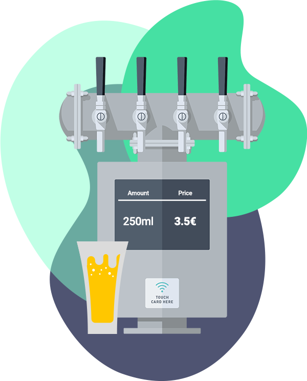

# Beer tap dispenser API

<p align="center">
    
</p>

## Table of contents
- [Description](#description)
- [Architecture](#architecture)
  * [Implementation decisions](#implementation-decisions)
  * [Improvements](#improvements)
- [Getting started](#getting-started)
  * [Technologies](#technologies)
  * [How to run the app](#how-to-run-the-app)
  * [How to run the test suite](#how-to-run-the-test-suite)

---

## Description

Within the [CHALLENGE-EXPLANATION](CHALLENGE-EXPLANATION.md) you can find the requirements for the **Beer tap dispenser API**.

---

## Architecture

The API has been implemented following an hexagonal architecture to build a better software reducing coupling and dependencies. Therefore, we have the following layers in our application:

- Controllers
- Application
  - Use cases
  - Inputs for each use case
- Domain
  - Entities
  - Services
  - Repositories
- Database + ORM

### Models
This layer has the logic to communicate with the database. We have the following models in our application:
- `DispenserRecord`
- `UsageRecord`

### Repositories
This layer has the logic to use the records. Our domain services use the repositories to communicate with the ORM layer. We have the following repositories in our API:
- `BaseRepository`.
  It implements some methods to do the most common operations of the ORM.
- `DispenserRepository`
  It implements some methods to create, update and find a `DispenserRecord`.
- `UsageRepository`
  It implements some methods to create, update and find an `UsageRecord`.

### Services
This layer has a set of services which implement the business logic of our API application. For example:
- A service to create a dispenser.
- A service to update a dispenser.
- A service to find a dispenser given an ID.
- A service to create an usage.
- A service to update an usage.
- A service to find the usage that is in progress in a certain moment.
- A service to get the usages for a certain dispensers.
- A service to get the total spent for a certain usage.
- A service to get the spending for a certain dispenser.

### Use cases
This layer has a set of use cases which support the endpoints of our API application. For example:
- An use case to create a dispenser.
- An use case to open a dispenser.
- An use case to close a dispenser.
- An use case to get the spending for a certain dispenser.

### Implementation decisions

1. Use of UUIDs as primary key for database tables.

   It has advantages and disadvatages but we decided to use them for these reasons:
    - It was a requirement in the API for the responses and URLs
    - In order to avoid calculating the UUID when a record is created in the database

2. Size and precision of `string` and `decimal` columns.

   It is a balance between supporting the API requirements and saving space in the database.

3. We added some indexes in DB to optimase the searchs over these columns.
   - Table `dispensers`: `created_at`
   - Table `usages`: `created_at`
   - Table `usages`: `closed_at`

4. We persisted the **flow volume** both in the `dispensers` and the `usages` tables.
   - In case the dispenser `flow volume` could change in the future, the usages need to know the flow volume when the dispenser was used.

5. We persisted a field `status` in the `dispensers` table to be able to check it easily and quickly.

6. API responses. We decided to build the endpoints responses implementing a basic and custom JSON serialization instead of using a gem to do it.


### Improvements

- Add some integration tests for the requests we have in our API.
- Handle the errors in a better way to give the client further details about what happened.
- Improve the serializers layer to build.
- Configure Sidekiq and a Redis server so that Sidekiq is able to run background jobs.

---

## Getting started

### Technologies

* [Ruby](https://www.ruby-lang.org/en/) (Version: `3.1.0`)
* [Ruby on Rails](https://rubyonrails.org/) (Version: `7.0.4.2`)
* [PostgreSQL](https://www.postgresql.org/)
* [MiniTest](https://github.com/minitest/minitest)
* [Docker](https://www.docker.com/)
* [Make](https://www.gnu.org/software/make/manual/make.html)
* [Rspec](https://github.com/rspec/rspec-rails) (Version: `6.0.1`)


### How to run the app

Within the [Makefile](Makefile) you can handle the entire flow to get everything up & running:

1. Install `make` on your computer, if you do not already have it.
2. Build the application: `make build`
3. Start the application: `make up`


### How to run the test suite

As we use Rspec for unit testing, you can run the whole test suite through the following command:
```shell
docker compose run -e RAILS_ENV=development --rm ruby-skeleton-api sh -c "bundle exec rspec spec/"
```
